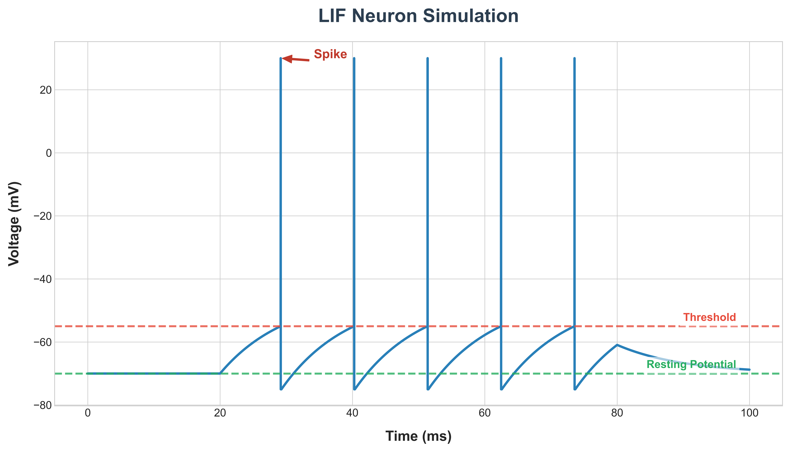

# Biological Neuron Activity Simulation (LIF Model) 🧠⚡

> **Project for Young Scientist Conference 2026 - HCMUS**
> *(Đề tài tham dự Hội nghị Khoa học Trẻ lần 3 - ĐH Khoa học Tự nhiên, ĐHQG-HCM)*

## 📖 Introduction (Giới thiệu)
Dự án mô phỏng hoạt động điện thế của tế bào thần kinh sinh học (Biological Neuron) sử dụng mô hình **Leaky Integrate-and-Fire (LIF)**.

Điểm đặc biệt của dự án là được xây dựng **hoàn toàn bằng C++ từ con số 0 (from scratch)**, không sử dụng các thư viện mô phỏng có sẵn (như NEST hay Brian2). Mục tiêu là chứng minh khả năng tối ưu hóa hiệu năng tính toán và tái hiện chính xác cơ chế phát xung (Spiking) thông qua việc giải phương trình vi phân bằng phương pháp số học.

## 🚀 Key Features (Tính năng nổi bật)
- **High Performance:** Tối ưu hóa tốc độ tính toán với ngôn ngữ C++ và quản lý bộ nhớ thủ công.
- **Numerical Method:** Sử dụng phương pháp **Euler Integration** (bước nhảy `dt = 0.1ms`) để giải phương trình vi phân tuyến tính bậc nhất.
- **Biophysical Accuracy:** Tái hiện chính xác hiện tượng "All-or-None" (Tất cả hoặc không) và giai đoạn trơ (Refractory period) của nơ-ron.
- **Data Export:** Xuất dữ liệu điện thế màng (Membrane Potential) ra file `.csv` để phân tích trực quan.

## 🛠️ Tech Stack (Công nghệ sử dụng)
- **Language:** C++ (Standard C++11/17)
- **Compiler:** G++ (MinGW)
- **Tools:** VS Code
- **Data Visualization:** Python (Matplotlib) / Excel

## 💻 How to Run (Cách chạy chương trình)
Để chạy mô phỏng trên máy của bạn, hãy thực hiện các lệnh sau:

```bash
# 1. Clone dự án về máy
git clone https://github.com/ThanhTran-HCMUS/LIF-Neuron-Simulation-CPP.git

# 2. Di chuyển vào thư mục dự án
cd LIF-Neuron-Simulation-CPP

# 3. Biên dịch mã nguồn bằng g++
g++ src/main.cpp -o neuron_sim

# 4. Chạy chương trình
./neuron_sim
```

## 📊 Results (Kết quả mô phỏng)
Kết quả mô phỏng cho thấy nơ-ron hoạt động đúng theo lý thuyết sinh học thần kinh:

* **Resting Potential (Điện thế nghỉ):** -70 mV
* **Threshold (Ngưỡng kích hoạt):** -55 mV
* **Spike Peak (Đỉnh xung):** 30 mV
* **Refractory Period (Giai đoạn trơ):** 2 ms

**Biểu đồ điện thế màng theo thời gian (Membrane Potential vs Time):**



*(Biểu đồ minh họa các xung điện (Spikes) được bắn ra khi điện thế vượt ngưỡng -55mV)*

## 👨‍💻 Author (Tác giả)
**Trần Minh Thành**
* **Role:** Independent Researcher (Nghiên cứu độc lập)
* **Major:** Information Technology - K2025 (Khoa Công nghệ Thông tin)
* **University:** University of Science, VNU-HCM (Trường ĐH Khoa học Tự nhiên - ĐHQG-HCM)
* **Email:** tmthanh2530@clc.fitus.edu.vn

---
*Project developed for the Young Scientist Conference 2026.*
*Created with ❤️ and C++.*
